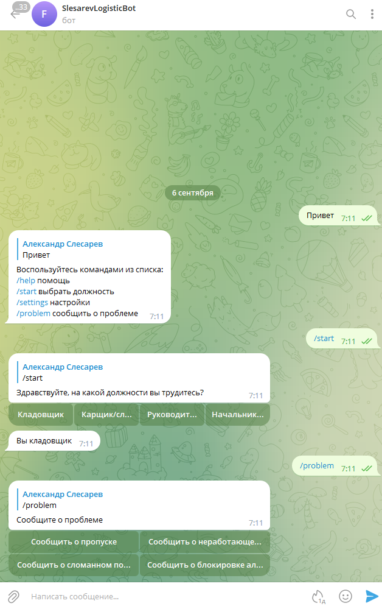

# **SlesarevLogisticBot**
## _Краткое описание_
Чат-бот позволяет сотрудникам разных должностей логистической системы сообщать о проблемах непосредственно отвечающим за это работникам.

Пользователи сохраняются в БД MySQL.
Основной класс наследуется от TelegramLongPollingBot. Используется библиотека Telegram Bots.
Для разворачивания проекта необходимо скачать исходный код. Далее запустить с ПК или в облаке.
Необходимо получить у BotFather Name и Token и прописать их в системные переменные.
## _Развитие проекта (предстоящие релизы)_
1. Изменение должности только после подтверждения начальником отдела.
2. Возможность сообщить о проблеме на определённом месте склада. Сохраение данных о месте в БД.
3. Временные кнопки. Предоставление возможности сообщить о проблеме через промежутки времени. Также уведомления ответственному пользователю о проблеме через промежутки времени.
4. Добавление опросов для пользователей.
